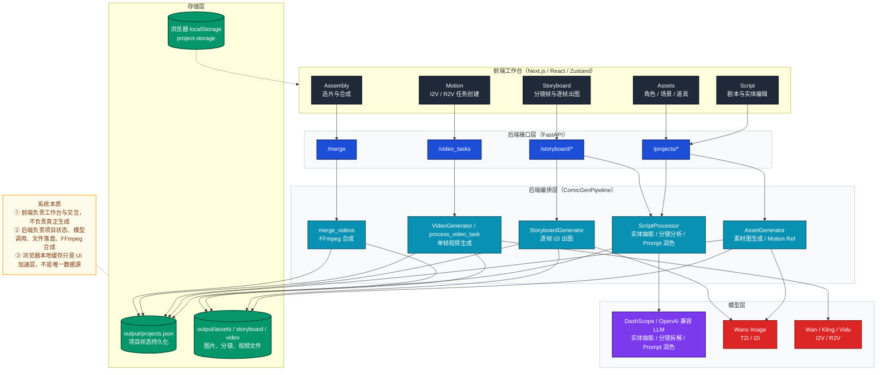
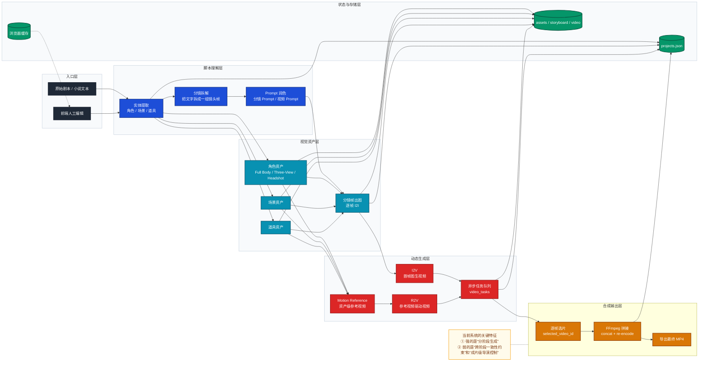
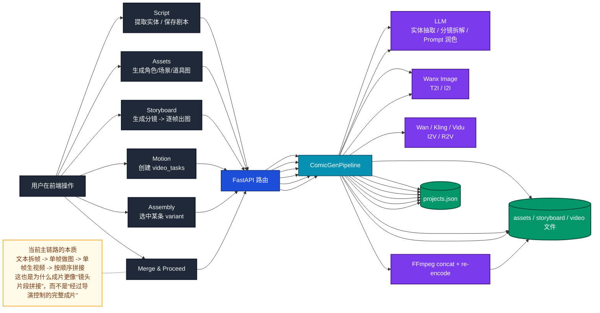

# AI 漫剧调用链与成片问题解析

> **文档职责**：基于当前项目源码，解释 `Script -> Storyboard -> Motion -> Assembly` 的真实调用链、前后端交互逻辑、模型调用方式，以及为什么当前产出的成片通常“不连贯、不可直接交付”。
> **适用场景**：已经实际跑过一遍流程，但对“为什么分镜不稳、视频不连贯、Assembly 像简单拼接”仍有疑问，希望从代码和系统设计层理解项目现状。
> **阅读目标**：读完后能够回答 3 个问题：一是每一步到底调用了什么；二是当前结果为什么会不稳定；三是要把它做成真正可用的 AI 漫剧平台，下一步应该补哪几层能力。

---

## 1. 先给结论

你这次的使用感受，和当前代码实现是吻合的。

这个项目现在更接近：

```text
剧本拆分工具 + 分镜图生成工具 + 单帧视频生成工具 + FFmpeg 拼接器
```

而不是：

```text
具备强时序一致性、镜头语法控制、角色持续稳定、场景连续校验、音画统一编排的“成片级 AI 漫剧生产系统”
```

所以你看到的几个问题，其实都能在代码里找到原因：

- `Storyboard` 生成的是一组 **按文本拆出来的静态分镜帧**，不是经过连续性约束后的镜头设计。
- `Motion` 生成的是 **每一帧各自独立的视频任务**，默认没有真正的跨帧连续性建模。
- `Assembly` 的本质是 **把选中的分镜视频做顺序拼接**，没有节奏设计、过渡设计、镜头连续性修正，也没有叙事层再编辑。

换句话说：

```text
当前系统的主链路是：
文本拆帧 -> 单帧做图 -> 单帧生视频 -> 顺序拼接
```

而不是：

```text
文本导演 -> 连续分镜设计 -> 角色/场景一致性约束 -> 镜头级动态生成 -> 时序剪辑 -> 音画总编
```

---

## 2. 系统架构图

这张图回答的是：当前项目由哪些层组成，前后端分别负责什么，模型和文件是怎么接进来的。



### 2.1 架构判断

这个项目的真实形态是：

- **前后端分离的本地优先工作流系统**
- **模块化单体后端**
- **文件落盘型生产管线**

它不是纯前端 local-first 应用，也不是 SaaS 型云端编排平台。

---

## 3. 分层能力结构图

这张图回答的是：从“做一条 AI 漫剧”这件事看，当前系统把能力分成了哪几层。



### 3.1 能力边界

当前项目已经有的，是这些能力：

- 文本实体化
- 分镜帧拆解
- 角色 / 场景 / 道具静态资产生成
- 逐帧分镜图生成
- 逐帧视频任务生成
- 顺序拼接输出

当前项目明显缺的，是这些能力：

- 场景连续性约束
- 角色跨镜头身份稳定
- 镜头语言规划器
- 节奏剪辑器
- 过渡镜头 / 转场设计
- 镜头间连续性打分与自动回修
- 真正意义上的“导演层”

---

## 4. 端到端流程图

这张图回答的是：用户在前端点按钮之后，请求是怎么进后端、后端怎么调模型、结果怎么落盘，再怎么回到前端的。



---

## 5. 按步骤看真实调用链

## 5.1 Script：剧本与实体

### 前端操作

用户在 `Script` 页面做两件事：

- 编辑剧本文本
- 点击“提取实体”或重新解析

前端组件是：

- [ScriptProcessor.tsx](/Users/admin/Downloads/Code/lumenx/frontend/src/components/modules/ScriptProcessor.tsx)

状态入口是：

- [projectStore.ts](/Users/admin/Downloads/Code/lumenx/frontend/src/store/projectStore.ts)

### 后端调用

真正的实体抽取发生在：

- [llm.py](/Users/admin/Downloads/Code/lumenx/src/apps/comic_gen/llm.py)
  - `parse_novel()`
  - `_create_script_from_data()`

这一层会把文本转成：

- `characters`
- `scenes`
- `props`
- 初始 `frames`（仅在解析时由 LLM 输出的结构）

### 当前问题

这一层的核心问题不是“不能抽实体”，而是：

- 实体名称和描述是 LLM 生成的，稳定性取决于 Prompt 和模型输出
- 后面每一层都强依赖这里的实体质量
- 一旦实体定义模糊，后面的素材、分镜、视频都会继续放大误差

---

## 5.2 Assets：角色 / 场景 / 道具素材

### 前端操作

用户在 `Assets` 页生成：

- 角色 `Full Body / Three-View / Headshot`
- 场景图
- 道具图
- Motion Reference 视频

前端组件是：

- [ConsistencyVault.tsx](/Users/admin/Downloads/Code/lumenx/frontend/src/components/modules/ConsistencyVault.tsx)
- [CharacterWorkbench.tsx](/Users/admin/Downloads/Code/lumenx/frontend/src/components/modules/CharacterWorkbench.tsx)

### 后端调用

静态图生成主链：

- [api.py](/Users/admin/Downloads/Code/lumenx/src/apps/comic_gen/api.py)
  - `/projects/{script_id}/assets/generate`
- [pipeline.py](/Users/admin/Downloads/Code/lumenx/src/apps/comic_gen/pipeline.py)
  - `generate_asset()`
- [assets.py](/Users/admin/Downloads/Code/lumenx/src/apps/comic_gen/assets.py)
  - `generate_character()`
  - `generate_scene()`
  - `generate_prop()`

动态图参考生成主链：

- [api.py](/Users/admin/Downloads/Code/lumenx/src/apps/comic_gen/api.py)
  - `/projects/{script_id}/assets/generate_motion_ref`
- [pipeline.py](/Users/admin/Downloads/Code/lumenx/src/apps/comic_gen/pipeline.py)
  - `create_motion_ref_task()`
  - `process_motion_ref_task()`
  - `generate_motion_ref()`

### 模型调用

- 角色 / 场景 / 道具静态图：`WanxImageModel`
- 资产 Motion Reference：`WanxModel.generate()` 的 I2V 路线

### 当前问题

这一层已经开始出现“连续性问题的根”：

- 角色图、场景图、道具图本身是**独立生成**的
- 虽然有“选中的 variant”概念，但没有更高层的“全局一致性校验器”
- `Full Body -> Three-View -> Headshot` 是**弱依赖链**，不是强锁定链

所以素材阶段已经可能出现：

- 角色主设不稳
- 场景气质和故事场景不完全一致
- 道具视觉风格和角色 / 场景不完全一体

---

## 5.3 Storyboard：分镜拆解与逐帧出图

### 前端操作

`Storyboard` 前端实际分成两段：

1. 点击 `生成分镜`
2. 对每一帧单独点击 `×1 / ×2 / ×3 / ×4` 生成静态图

前端组件：

- [StoryboardComposer.tsx](/Users/admin/Downloads/Code/lumenx/frontend/src/components/modules/StoryboardComposer.tsx)

### 分镜拆解链路

前端：

- `handleAnalyzeToStoryboard()`

后端：

- [api.py](/Users/admin/Downloads/Code/lumenx/src/apps/comic_gen/api.py)
  - `/projects/{script_id}/storyboard/analyze`
- [pipeline.py](/Users/admin/Downloads/Code/lumenx/src/apps/comic_gen/pipeline.py)
  - `analyze_text_to_frames()`
- [llm.py](/Users/admin/Downloads/Code/lumenx/src/apps/comic_gen/llm.py)
  - `analyze_to_storyboard()`

这一步本质上是：

```text
让 LLM 把文本拆成一组“单动作、单镜头”的 frame 结构
```

### 分镜图生成链路

前端：

- `handleRenderFrame()`

后端：

- [api.py](/Users/admin/Downloads/Code/lumenx/src/apps/comic_gen/api.py)
  - `/projects/{script_id}/storyboard/render`
- [pipeline.py](/Users/admin/Downloads/Code/lumenx/src/apps/comic_gen/pipeline.py)
  - `generate_storyboard_render()`
- [storyboard.py](/Users/admin/Downloads/Code/lumenx/src/apps/comic_gen/storyboard.py)
  - `generate_frame()`

### 这一层为什么容易“不连贯”

这是你这次最明显感受到的问题之一，原因有 4 个。

#### 1. 分镜拆解本身是文本驱动，不是连续空间建模

LLM 的任务是：

- 把文本拆成若干 frame
- 给每帧填 `scene_ref_name / character_ref_names / action_description / camera`

但它没有真正维护一个“连续场景状态机”。

所以当脚本写的是：

```text
都在旧图书馆里发生
```

模型仍然可能产出某一帧只聚焦：

- 人物
- 发光旧书

却没有把“图书馆环境”持续保留在这一帧里。

#### 2. 场景匹配有回退逻辑，匹配不到时会退到第一个场景

在 [pipeline.py](/Users/admin/Downloads/Code/lumenx/src/apps/comic_gen/pipeline.py) 的 `analyze_text_to_frames()` 里，`scene_ref_name` 如果匹配不到，会直接 fallback 到第一个场景。

这能保证流程不中断，但不能保证镜头真的“场景正确”。

#### 3. 每一帧出图是独立 I2I 调用

在 [StoryboardComposer.tsx](/Users/admin/Downloads/Code/lumenx/frontend/src/components/modules/StoryboardComposer.tsx) 里，逐帧点击 `×1 / ×2 / ×3 / ×4` 后，会单独调用渲染接口。

在 [storyboard.py](/Users/admin/Downloads/Code/lumenx/src/apps/comic_gen/storyboard.py) 里，`generate_frame()` 每次都是：

- 拼这一帧自己的 prompt
- 收这一帧自己的参考图
- 调一次 `WanxImageModel.generate()`

这意味着：

```text
帧 A 和帧 B 并不是“连续生成”的
而是“两次独立生成”
```

#### 4. 多参考图只是“参考输入”，不是强约束场景锁定

`generate_frame()` 会把：

- 当前 scene 图
- 当前 character 图
- 当前 prop 图

一起作为 `ref_image_paths` 传入 I2I。

但这更像：

```text
“请参考这些图”
```

而不是：

```text
“你必须保持这些元素在画面中稳定出现”
```

所以如果 prompt 里强调了人物动作、发光书本，模型仍可能把环境弱化甚至漂掉。

### 这一层的结论

`Storyboard` 现在是：

- **镜头拆解器**
- **逐帧静态图生成器**

不是：

- 连续镜头导演器
- 场景一致性规划器

---

## 5.4 Motion：逐帧视频任务生成

### 前端操作

`Motion` 前端分成两种模式：

- `I2V`：首帧图驱动
- `R2V`：参考视频驱动

前端组件：

- [VideoGenerator.tsx](/Users/admin/Downloads/Code/lumenx/frontend/src/components/modules/VideoGenerator.tsx)
- [VideoCreator.tsx](/Users/admin/Downloads/Code/lumenx/frontend/src/components/modules/VideoCreator.tsx)
- [VideoSidebar.tsx](/Users/admin/Downloads/Code/lumenx/frontend/src/components/modules/VideoSidebar.tsx)

### 前端做了什么

前端真正做的核心动作是：

1. 选择一张首帧图，或选择一条分镜描述与若干参考视频
2. 组装 prompt
3. 调 `api.createVideoTask(...)`
4. 把任务加进 `video_tasks`
5. 轮询任务状态

注意一个容易忽略的事实：

在 [VideoCreator.tsx](/Users/admin/Downloads/Code/lumenx/frontend/src/components/modules/VideoCreator.tsx) 里，所谓“镜头运动参数”很多其实是：

- 一部分进入参数面板
- 一部分被拼进 prompt
- 真正传到后端并被模型使用的，并没有你在 UI 里看到的那么强

例如当前 `process_video_task()` 里给 `WanxModel.generate()` 传的是：

- `shot_type`
- `ref_video_urls`
- 但 `camera_motion=None`
- `subject_motion=None`

也就是说：

```text
前端有一些“运动控制”更偏向 Prompt 层表达
并不是稳定的结构化运动控制
```

### 后端调用链

创建任务：

- [api.py](/Users/admin/Downloads/Code/lumenx/src/apps/comic_gen/api.py)
  - `/projects/{script_id}/video_tasks`
- [pipeline.py](/Users/admin/Downloads/Code/lumenx/src/apps/comic_gen/pipeline.py)
  - `create_video_task()`

处理任务：

- [pipeline.py](/Users/admin/Downloads/Code/lumenx/src/apps/comic_gen/pipeline.py)
  - `process_video_task()`

具体模型：

- [video.py](/Users/admin/Downloads/Code/lumenx/src/apps/comic_gen/video.py)
- [wanx.py](/Users/admin/Downloads/Code/lumenx/src/models/wanx.py)

### 模型路径

#### I2V

通常走：

- `wan2.6-i2v`
- `wan2.6-i2v-flash`
- `wan2.5-i2v`

底层在 [wanx.py](/Users/admin/Downloads/Code/lumenx/src/models/wanx.py) 里会走 `_generate_wan_i2v_http()`。

#### R2V

R2V 模式会强制用：

- `wan2.6-r2v`

底层走 `_generate_wan_r2v_http()`。

### 这一层为什么仍然不连贯

这是第二个核心问题。

#### 1. 每个视频任务本质上还是“单帧起步”

`create_video_task()` 会先把输入图做 snapshot，保存成 `output/video_inputs/{task_id}.png`。

这说明系统的默认思路是：

```text
每个视频任务 = 基于一张静态图单独生成
```

而不是：

```text
整条镜头序列统一规划、统一推进
```

#### 2. 相邻镜头之间没有显式时序约束

当前 `video_tasks` 是一堆并列任务。

它们之间只有：

- `frame_id`
- prompt
- 选中的输入图

没有真正的：

- 上一镜头状态 -> 下一镜头状态
- 角色运动连续轨迹
- 场景光照连续约束
- 镜头节奏约束

#### 3. “Prev End Frame” 只是补丁，不是完整时序系统

你在 `Storyboard / Motion` 里看到的 `Use Prev End Frame`，本质上是：

- 从前一段视频里截最后一帧
- 塞回当前帧作为新的静态图参考

对应代码：

- [StoryboardComposer.tsx](/Users/admin/Downloads/Code/lumenx/frontend/src/components/modules/StoryboardComposer.tsx)
- [pipeline.py](/Users/admin/Downloads/Code/lumenx/src/apps/comic_gen/pipeline.py)
  - `extract_last_frame()`

这能改善“镜头切过去时画风跳变”的问题，但它不是：

- 真正的镜头连续运动建模
- 真正的角色姿态传递系统

所以它只能算一个局部修补点。

#### 4. R2V 也不是“完整导演模式”

R2V 的作用更接近：

```text
给模型几个角色参考视频，让它更容易理解角色怎么动
```

但当前实现里，它仍然是：

- 选一个 frame
- 选若干参考视频
- 生成一个新的任务

它不是完整的“镜头时序编排器”。

### 这一层的结论

`Motion` 现在更像：

- **单帧起步的视频任务工厂**

而不是：

- **多镜头时序导演器**

---

## 5.5 Assembly：为什么像简单拼接

### 前端操作

`Assembly` 页的工作只有两件：

1. 每帧选一条你认为最好的视频
2. 点 `Merge & Proceed`

前端组件：

- [VideoAssembly.tsx](/Users/admin/Downloads/Code/lumenx/frontend/src/components/modules/VideoAssembly.tsx)

### 后端调用链

选择某个版本：

- `/projects/{script_id}/frames/{frame_id}/select_video`
- `select_video_for_frame()`

合成：

- `/projects/{script_id}/merge`
- `merge_videos()`

### 合成到底做了什么

这一层的答案非常明确：

**就是顺序拼接。**

`merge_videos()` 会：

1. 按 `script.frames` 顺序遍历
2. 取每帧的 `selected_video_id`
3. 生成一个 FFmpeg concat list
4. 用 FFmpeg 重新编码输出一个最终 mp4

对应代码在：

- [pipeline.py](/Users/admin/Downloads/Code/lumenx/src/apps/comic_gen/pipeline.py)
  - `merge_videos()`

FFmpeg 调用方式是：

```text
concat demuxer + libx264 + aac
```

也就是：

```text
ffmpeg -f concat -i merge_list.txt -c:v libx264 -c:a aac ...
```

### 这意味着什么

这一步**不会**做下面这些事情：

- 不会重写镜头内容
- 不会修正角色跳变
- 不会修正场景错位
- 不会自动做过渡镜头
- 不会做节奏剪辑
- 不会做对白对口型
- 不会做情绪强弱曲线
- 不会做电影语言层面的再导演

所以你感觉它像“把生成的分镜简单拼接”，这个判断是对的，因为代码就是这么做的。

### 这一层的结论

`Assembly` 当前是：

- **技术合成层**

不是：

- **剪辑导演层**

---

## 6. 为什么你这次成片“基本不能用”

结合这次体验，核心原因可以概括成 5 条。

### 6.1 问题 1：文本到分镜是“语义拆解”，不是“空间连续导演”

系统能把剧情拆成镜头，但不能稳定保证：

- 每帧都保留核心环境锚点
- 同一场景在多帧里保持统一空间感

所以你会看到：

- 明明故事在图书馆
- 某一帧却只剩人物和道具

### 6.2 问题 2：分镜图是逐帧独立生成

每一帧都像一次新的 I2I 请求。

即使参考图相同，也可能出现：

- 构图漂移
- 环境细节消失
- 角色比例波动

### 6.3 问题 3：动态视频是逐帧独立生成

`Motion` 不是“把整组分镜当成一个连续片段去做”，而是：

- 每帧自己生成一段视频

这天然容易出现：

- 角色动作不接
- 场景灯光不接
- 镜头速度不接

### 6.4 问题 4：Assembly 不负责叙事修正

它只负责：

- 取每帧选中的视频
- 按顺序拼起来

所以所有前面没修掉的问题，都会原样带进成片。

### 6.5 问题 5：系统里还缺“导演层”

当前最缺的不是又多一个模型，而是一个真正的：

- 场景连续性管理器
- 角色一致性管理器
- 镜头节奏管理器
- 成片剪辑器

---

## 7. 从代码看：当前系统更适合做什么

如果按现状使用，这个项目更适合：

- 做 **概念验证**
- 做 **镜头草稿**
- 做 **分镜探索**
- 做 **角色 / 场景视觉开发**
- 做 **短片段实验**

不太适合直接做：

- 长段连续 AI 漫剧
- 对时序一致性要求高的成片
- 直接交付级的完整短剧

---

## 8. 如果要把它做成真正可用的 AI 漫剧平台，下一步缺什么

建议补的不是“再多接一个模型”，而是下面这些层。

### 8.1 分镜连续性层

要补：

- 场景锚点检测
- 镜头连续性检查
- 人物 / 道具 / 场景出现完整性检查

### 8.2 角色一致性层

要补：

- 角色主参考锁定
- 跨帧角色身份一致性评分
- 角色漂移报警和回退

### 8.3 镜头导演层

要补：

- 开场镜头 / 建立镜头模板
- 特写 / 中景 / 全景节奏规则
- 镜头之间的语义过渡

### 8.4 时序视频层

要补：

- 多帧联合生成
- 上一镜头状态传递到下一镜头
- 角色姿态与空间状态连续约束

### 8.5 剪辑层

要补：

- 自动过渡
- 时长裁剪
- 节奏调整
- 音频对齐
- 分镜到成片的再编辑

---

## 9. 这份结论对你当前二开的意义

如果你要基于这个项目继续做 AI 漫剧平台，当前底座仍然有价值，因为它已经具备：

- 前端工作台
- 后端项目状态
- 文件落盘
- 多模型接入
- 分阶段生产链

但它现在更像：

```text
生产管线原型
```

而不是：

```text
成片质量可控的导演系统
```

所以二开的重点应该放在：

```text
连续性约束 + 导演层 + 剪辑层
```

而不是只继续往现有链路里堆更多生成按钮。

---

## 10. 一句话总结

当前项目之所以让你感觉“从 `Script` 到 `Assembly` 跑通了，但成片基本不能用”，不是因为某一步单独坏了，而是因为整条链路目前仍然是：

```text
按步骤生成得出来
≠
按导演逻辑做得连贯
```

它已经能把流程跑通，但离“可直接交付的 AI 漫剧生产系统”还差一整层导演与剪辑能力。
