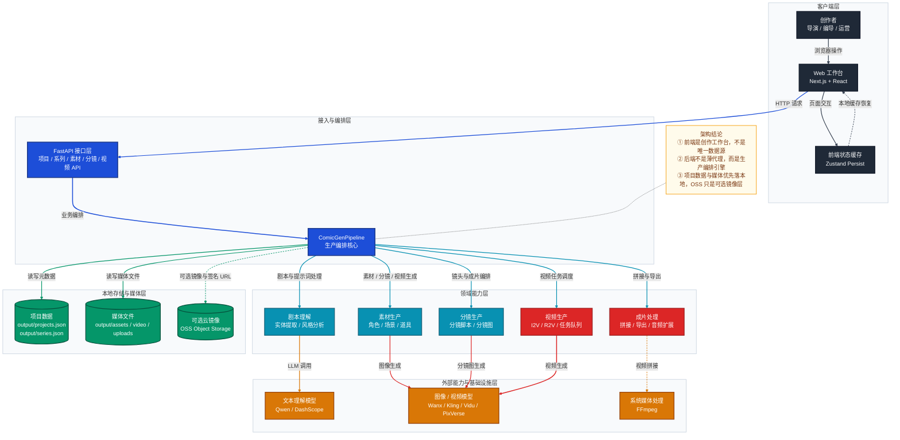
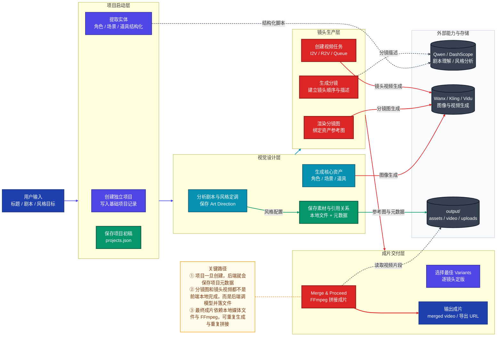

# 平台架构与典型场景图解

> **文档职责**：用统一风格的 3 张 Mermaid 图，帮助读者快速理解本项目的系统组成、能力分层和端到端生产链路，并结合一个典型场景解释完整输入与输出。
> **适用场景**：适合架构评审、二开立项、产品方案讨论、功能重构前的整体理解。
> **阅读目标**：读完后，你应当能够回答 3 个问题：系统由什么组成、能力按什么层展开、一次 AI 漫剧制作任务是如何从输入走到成片输出的。

## 阅读顺序

这份文档按下面顺序阅读最合适：

1. 先看系统架构图，理解系统由哪些组件构成。
2. 再看分层能力结构图，理解平台能力按什么层展开。
3. 最后看端到端流程图，理解一个项目是如何一步步走到成片的。

## 一、系统架构图

这张图回答的问题是：**这个项目由哪些核心组件构成，它们如何连接，真正的生产逻辑落在哪一层。**



### 图后结论

- 这是一个典型的**前端工作台 + 后端编排引擎**架构。
- 前端负责交互、编辑、流程导航和局部缓存。
- 后端负责项目状态、媒体文件、模型调用、任务执行和成片拼接。
- 这也是为什么本项目不是“前端直接调模型 API，后端只做代理”的轻架构。

## 二、分层能力结构图

这张图回答的问题是：**平台能力按哪些层展开，每一层分别解决什么问题。**

```mermaid
flowchart LR
    classDef entryStyle   fill:#1f2937,stroke:#111827,stroke-width:2px,color:#f9fafb
    classDef scriptStyle  fill:#1d4ed8,stroke:#1e3a8a,stroke-width:2px,color:#fff
    classDef visualStyle  fill:#0891b2,stroke:#155e75,stroke-width:2px,color:#fff
    classDef videoStyle   fill:#dc2626,stroke:#991b1b,stroke-width:2px,color:#fff
    classDef opsStyle     fill:#d97706,stroke:#92400e,stroke-width:2px,color:#fff
    classDef storeStyle   fill:#059669,stroke:#064e3b,stroke-width:2px,color:#fff
    classDef noteStyle    fill:#fffbeb,stroke:#f59e0b,stroke-width:1.5px,color:#78350f
    classDef layerStyle   fill:#f8fafc,stroke:#cbd5e0,stroke-width:1.5px

    subgraph ENTRY["入口层 Entry"]
        direction LR
        SINGLE["创建独立项目<br>单集短视频启动"]:::entryStyle
        SERIES["创建系列<br>连续剧集入口"]:::entryStyle
        IMPORT["导入文件<br>TXT / MD 拆集导入"]:::entryStyle
        CONFIG["环境与模型设置<br>API Key / Provider / Prompt"]:::entryStyle
    end
    class ENTRY layerStyle

    subgraph SCRIPT_LAYER["剧本理解层 Script Understanding"]
        direction LR
        EDIT["剧本编辑<br>原文整理 / 文本修订"]:::scriptStyle
        ENTITY["实体提取<br>角色 / 场景 / 道具识别"]:::scriptStyle
        STYLE["风格定调<br>分析剧本 / 选择风格"]:::scriptStyle
        PROMPT["提示词治理<br>正向 / 负向 / 润色配置"]:::scriptStyle
    end
    class SCRIPT_LAYER layerStyle

    subgraph VISUAL_LAYER["视觉资产层 Visual Asset Production"]
        direction LR
        CHAR["角色资产<br>全身图 / 三视图 / 头像"]:::visualStyle
        SCENE["场景资产<br>空间氛围 / 时代感 / 光线"]:::visualStyle
        PROP["道具资产<br>关键物件 / 视觉锚点"]:::visualStyle
        REF["上传与参考<br>本地图 / 反向生成 / 一致性控制"]:::visualStyle
    end
    class VISUAL_LAYER layerStyle

    subgraph SHOT_LAYER["镜头生产层 Shot Production"]
        direction LR
        BOARD["分镜构造<br>生成分镜 / 手动编辑"]:::videoStyle
        FRAME["分镜图生成<br>参考图绑定 / 多版本候选"]:::videoStyle
        MOTION["镜头视频生成<br>I2V / R2V"]:::videoStyle
        QUEUE["任务管理<br>队列 / 重试 / Remix"]:::videoStyle
    end
    class SHOT_LAYER layerStyle

    subgraph DELIVERY["成片与治理层 Delivery & Governance"]
        direction LR
        ASSEMBLY["成片拼接<br>Variants 选择 / Merge"]:::opsStyle
        EXPORT["导出扩展<br>Export / Voice / Final Mix"]:::opsStyle
        PROJECT["项目治理<br>项目 / 系列 / 集数复用"]:::opsStyle
        ROUTING["路由与存储<br>Local-first / OSS / Provider Routing"]:::opsStyle
    end
    class DELIVERY layerStyle

    subgraph STORE["沉淀层 Storage & Reuse"]
        direction LR
        META["项目元数据<br>脚本 / 资产 / 分镜 / 视频状态"]:::storeStyle
        MEDIA["媒体资产池<br>图片 / 视频 / 上传素材"]:::storeStyle
        REUSE["复用能力<br>系列共享角色 / 场景 / 道具"]:::storeStyle
    end
    class STORE layerStyle

    ENTRY -->|"创作启动"| SCRIPT_LAYER
    SCRIPT_LAYER -->|"剧本结构化结果"| VISUAL_LAYER
    VISUAL_LAYER -->|"稳定参考资产"| SHOT_LAYER
    SHOT_LAYER -->|"镜头视频候选"| DELIVERY
    DELIVERY -->|"项目沉淀与复用"| STORE

    NOTE["阅读方式<br>① 这张图看的是能力分层，不是服务拓扑<br>② 层内节点表示并列能力块，不表示严格先后顺序<br>③ 真正的主制作链路是：入口 -> 剧本理解 -> 视觉资产 -> 镜头生产 -> 成片治理"]:::noteStyle
    NOTE -.- STORE

    %% 边索引：0-5，共 6 条
    linkStyle 0 stroke:#1f2937,stroke-width:2px
    linkStyle 1 stroke:#1d4ed8,stroke-width:2px
    linkStyle 2 stroke:#0891b2,stroke-width:2px
    linkStyle 3 stroke:#dc2626,stroke-width:2px
    linkStyle 4 stroke:#d97706,stroke-width:2px
    linkStyle 5 stroke:#059669,stroke-width:1.5px,stroke-dasharray:4 3
```



### 图后结论

- 这个平台的核心不是“单次生成”，而是**项目制生产链**。
- 真正有价值的部分不是单个模型能力，而是“剧本理解 -> 资产沉淀 -> 镜头生产 -> 成片治理”这一整套链路。
- 如果后续要做二开或重构，最值得保护的是这些层之间的边界，而不是某个页面长什么样。

## 三、端到端流程图

这张图回答的问题是：**一次典型的 AI 漫剧生产任务，从用户输入到最终成片，是如何同步流转的。**



### 图后结论

- 这条链路里，前端负责“发起动作、编辑结果、选择版本”，后端负责“理解、生成、存储、拼接”。
- 真正的中间产物包括：结构化实体、风格配置、素材资产、分镜帧、镜头视频候选。
- 最终输出不是一次性的 API 响应，而是一组可以复用的项目资产和一条成片。

## 四、典型应用场景

这里选择一个最典型、也最适合新用户上手的场景：

**场景名称：制作一条 30 秒以内的单集悬疑 AI 漫剧短片**

目标是做一条单独成片，不先进入系列模式。

### 4.1 场景背景

创作者想制作一条悬疑向短漫剧，用于：

- 抖音 / 视频号预告片
- 漫剧项目的试风格样片
- 小团队先验证角色、场景和镜头语言是否可行

这个场景非常适合用 `创建独立项目` 启动，而不是一开始就做系列化生产。

### 4.2 完整输入

这里把“完整输入”拆成 5 类，便于你理解平台真正接收了什么。

#### 1. 项目输入

```text
项目标题：夜馆异书
项目类型：独立项目
目标时长：20~30 秒
成片比例：9:16
```

#### 2. 原始剧本输入

```text
夜晚，小满独自走进旧图书馆。大厅里只亮着一盏昏黄的吊灯，空气里飘着灰尘。
她听见书架深处传来翻书声，停下脚步，紧张地望向黑暗处。
一本发光的旧书从书架中缓缓滑出，悬停在她面前。
小满伸手碰到封面，整座图书馆瞬间亮起蓝色纹路。
```

#### 3. 风格目标输入

```text
风格方向：悬疑、写实漫画、冷色氛围、电影感灯光
负向约束：不要儿童绘本感，不要 Q 版，不要高饱和可爱风
```

#### 4. 素材参考输入

可以为空，也可以补充：

- 角色参考图 1 张
- 场景参考图 1 张
- 旧书道具参考图 1 张

如果没有上传参考图，也可以完全让平台从文本生成。

#### 5. 运行环境输入

```text
DASHSCOPE_API_KEY=已配置
FFmpeg=已安装
Provider Mode=默认 dashscope
存储模式=本地优先，可选 OSS
```

### 4.3 关键中间产物

这个场景在系统内部，通常会逐步得到下面这些中间产物：

#### 1. 结构化剧本结果

例如：

- 角色：小满
- 场景：旧图书馆大厅、黑暗书架区
- 道具：发光旧书、吊灯

这一步的意义是把原始文本变成后续各模块都能消费的结构化数据。

#### 2. 全局风格配置

例如：

- 正向提示词：写实漫画、冷色电影光效、悬疑氛围、细节丰富的旧图书馆
- 负向提示词：卡通、儿童风、低清晰度、夸张比例

这一步的意义是把“审美方向”从模糊描述变成可复用的生成约束。

#### 3. 核心素材资产

例如：

- 小满角色主参考图
- 旧图书馆大厅场景图
- 发光旧书道具图

这一步的意义是建立镜头生产时可复用的视觉锚点。

#### 4. 分镜结果

例如可以拆成 4 个镜头：

1. 小满走入旧图书馆全景
2. 小满停下脚步、看向黑暗处中景
3. 发光旧书悬浮特写
4. 触碰封面后蓝色纹路扩散的高潮镜头

这一步的意义是把故事拆成能被生成视频的镜头单元。

#### 5. 镜头视频候选

例如每个分镜生成 2 个视频版本：

- Frame 1：2 个候选
- Frame 2：2 个候选
- Frame 3：2 个候选
- Frame 4：2 个候选

这一步的意义是允许创作者在成片前做“镜头抽卡”和筛选，而不是一次生成直接定版。

### 4.4 完整输出

这个场景的“完整输出”也不是只有一条视频，而是分成 3 层：

#### 1. 面向用户的最终输出

- 一条可以播放的合并成片
- 一个可回到工作台继续编辑的项目

#### 2. 面向生产的中间输出

- 已保存的项目元数据
- 已保存的角色 / 场景 / 道具素材
- 已保存的分镜帧
- 已保存的镜头视频任务和候选结果

#### 3. 面向系统的文件输出

通常会落到本地 `output/` 下，例如：

- `output/projects.json`
- `output/assets/...`
- `output/video/...`
- `output/uploads/...`

如果配置了 OSS，还会额外有：

- 对象存储中的镜像文件
- 返回前端时附带签名 URL 的媒体地址

### 4.5 这个场景为什么典型

因为它刚好覆盖了本项目最核心的 6 步主链路：

1. `Script`
2. `Art Direction`
3. `Assets`
4. `Storyboard`
5. `Motion`
6. `Assembly`

也就是说，只要你能把这个场景跑通，你基本就已经掌握了本平台的核心使用方式。

## 五、从二开角度看，这 3 张图说明了什么

如果你是基于本项目做二开，这 3 张图实际上给出了 3 个很重要的判断：

### 1. 这不是前端主导的轻平台

它更接近“工作流编排型生产平台”，后端承担了真实生产职责。

### 2. 最值得保护的是能力链路，不是页面外观

页面可以重做，但下面这些链路最好不要轻易打散：

- 剧本理解
- 资产沉淀
- 分镜生产
- 视频任务
- 成片拼接

### 3. 真正适合重构的是后端内部边界

如果后续要演进，这个项目更适合：

- 继续保留前后端分离
- 保留 local-first 存储逻辑
- 重构 `pipeline` 内部职责拆分
- 引入更明确的任务层、存储层和模型适配层

而不是回退成“前端自己存一切、后端只做 API 转发”的模式。

## 六、总结

用一句话概括这份图解：

**这个项目的本质，是一个以项目制生产链为核心的 AI 漫剧工作台与后端编排引擎，而不是一个只包了一层模型调用的前端工具。**

因此它更适合：

- 做长期二开
- 做生产流程扩展
- 做系列化和资产复用
- 做后续平台化重构

而不是只做一次性的 AI 生成功能演示。
