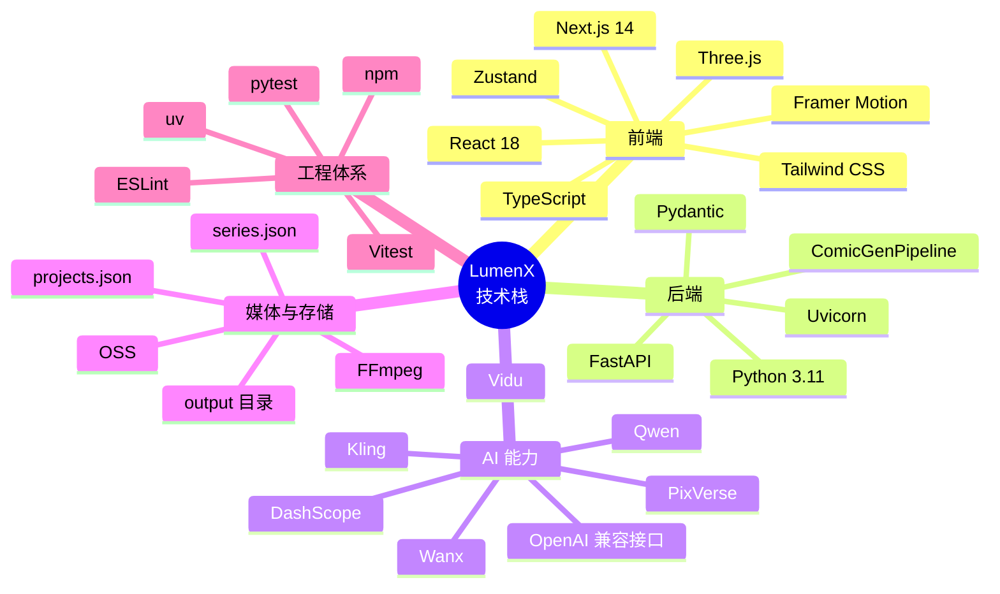

> **文档职责**：整理本项目当前技术栈与选型理由。
> **适用场景**：用于项目介绍、技术评审、二开前的技术基线说明。
> **阅读目标**：快速了解本项目用了什么技术、为什么这样选、当前适用边界是什么。

# 本项目技术栈选型方案

## 1. 文档概述

本项目是一个 AI 漫剧生产平台，覆盖 `Script -> Assets -> Storyboard -> Motion -> Assembly` 的完整工作流。  
技术选型目标主要有 4 个：

- 支撑多步骤创作工作台
- 支撑文本、图像、视频、语音的统一编排
- 支撑本地优先的文件与项目管理
- 为后续平台化演进预留扩展空间

## 2. 技术栈总览

| 分层 | 技术选型 | 说明 |
|------|----------|------|
| 前端框架 | Next.js 14、React 18、TypeScript | 构建多步骤创作工作台 |
| 前端状态 | Zustand | 管理项目状态与本地缓存 |
| 前端样式与交互 | Tailwind CSS、Framer Motion | 负责样式与交互动效 |
| 前端视觉能力 | Three.js、@react-three/fiber、@react-three/drei | 支撑创意化视觉呈现 |
| 接口通信 | Axios | 前后端 API 通信 |
| 后端框架 | Python 3.11、FastAPI、Uvicorn | 提供 API、文件服务与流程入口 |
| 数据建模 | Pydantic、pydantic-settings | 定义请求、响应与项目对象 |
| 流程编排 | ComicGenPipeline | 串联剧本、资产、分镜、视频、合成等环节 |
| LLM 能力 | Qwen、DashScope、OpenAI 兼容 SDK | 实体提取、风格分析、提示词润色 |
| 图像与视频模型 | Wanx、Kling、Vidu、PixVerse | 图像生成、I2V、R2V 等能力 |
| 模型路由 | Provider Registry、ModelFactory | 统一多模型、多供应商接入 |
| 媒体处理 | FFmpeg | 视频拼接、音频提取、媒体处理 |
| 存储 | 本地 `output/`、`projects.json`、`series.json`、OSS | local-first 持久化与可选云存储 |
| Python 依赖管理 | uv | 创建虚拟环境、同步依赖、锁定版本 |
| 前端依赖管理 | npm | 管理前端依赖与构建 |
| 测试 | pytest、Vitest、Testing Library | 后端与前端测试 |

## 3. 技术栈结构图

这张图回答的问题是：**本项目的技术栈按知识结构如何分层归类。**

## 4. 分层选型说明

### 4.1 前端层

| 选型 | 用途 | 选型理由 |
|------|------|----------|
| Next.js 14 + React 18 + TypeScript | 前端工作台 | 适合构建复杂、多步骤、组件化的创作界面 |
| Zustand | 状态管理 | 轻量，适合项目状态、本地缓存和 UI 状态管理 |
| Tailwind CSS + Framer Motion | 样式与动效 | 提升开发效率与交互体验 |
| Three.js 生态 | 视觉表现 | 增强产品的创意感与展示能力 |

### 4.2 后端层

| 选型 | 用途 | 选型理由 |
|------|------|----------|
| Python 3.11 | 后端语言 | 适合 AI、脚本、媒体处理场景 |
| FastAPI + Uvicorn | API 服务 | 开发效率高，适合 AI 应用与文件服务 |
| Pydantic | 数据建模 | 统一请求、响应与项目结构，降低前后端对接成本 |
| ComicGenPipeline | 流程编排 | 将多个生产步骤串成完整链路 |

### 4.3 AI 能力层

| 选型 | 用途 | 选型理由 |
|------|------|----------|
| Qwen + DashScope | 文本理解 | 负责剧本分析、实体提取、风格分析、提示词润色 |
| OpenAI 兼容 SDK | 模型调用兼容层 | 降低接入复杂度，统一调用方式 |
| Wanx | 图像与视频主能力 | 承担文生图、图生视频、参考生视频等链路 |
| Kling / Vidu / PixVerse | 扩展视频模型 | 为多供应商、多模型策略预留空间 |
| Provider Registry + ModelFactory | 模型路由与实例化 | 避免业务代码写死模型接入逻辑 |

### 4.4 媒体与存储层

| 选型 | 用途 | 选型理由 |
|------|------|----------|
| FFmpeg | 媒体处理 | 负责视频拼接、音频提取等本地媒体处理 |
| `output/` 目录 | 本地文件存储 | 便于本地创作、调试和排障 |
| `projects.json`、`series.json` | 项目持久化 | 当前阶段实现简单，适合 local-first 原型 |
| OSS | 可选对象存储 | 用于文件镜像、签名访问和云端扩展 |

### 4.5 工程与测试层

| 选型 | 用途 | 选型理由 |
|------|------|----------|
| uv | Python 依赖管理 | 速度快，适合现代 Python 项目 |
| npm | 前端依赖管理 | 兼容 Next.js 生态 |
| pytest | 后端测试 | 适合路由与业务逻辑测试 |
| Vitest + Testing Library | 前端测试 | 适合组件交互与状态测试 |
| ESLint | 前端质量控制 | 保持代码一致性 |

## 5. 当前选型特点

### 5.1 优势

- 前后端分层清晰，适合 AI 工作流应用
- 已具备多模型接入与路由能力
- 本地优先，便于个人创作和快速调试
- 技术栈成熟，学习与维护成本可控

### 5.2 当前边界

- 持久化仍以 JSON 为主，更适合原型和单机创作
- `Assembly` 当前更接近视频拼接，不是完整时间线剪辑
- `Audio` 和 `Export` 部分能力仍有原型性质
- 若走生产级平台，后续更适合升级为数据库、任务队列和对象存储方案

## 6. 结论

本项目当前技术栈选型是合理的，适合作为 AI 漫剧平台的二开基础：

- 前端适合承接复杂工作台
- 后端适合承接 AI 编排与文件处理
- 模型层已有扩展意识
- 工程体系已经具备项目化管理基础

如果后续目标是生产级平台，建议保留当前技术方向，重点升级数据层、任务层和媒体合成层，而不是推倒重来。
