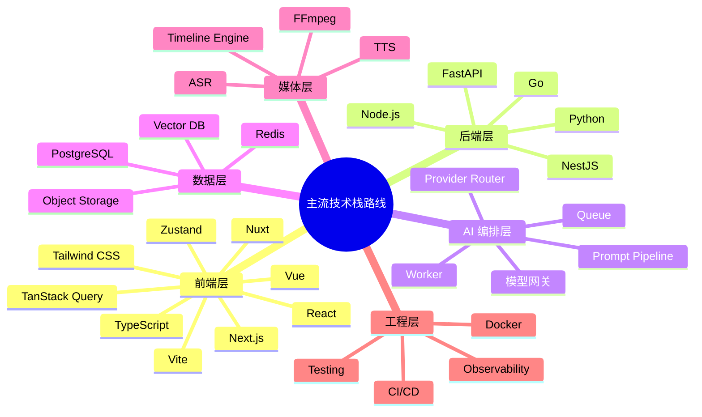

> **文档职责**：从内部技术评审视角，评估本项目当前技术栈是否合理，是否适合作为 AI 漫剧平台底座。
> **适用场景**：技术评审、二开前评估、架构方向讨论。
> **阅读目标**：明确当前技术栈的优点、短板、与主流方案的差异，以及后续保留或升级建议。

# 项目技术栈评估报告

## 1. 前置阅读

为避免和已有文档重复，这份报告不再展开解释技术术语和框架家族，只聚焦“评估”。

如需先理解技术层次和框架家族，建议先看：

- [本项目技术栈选型方案.md](/Users/admin/Downloads/Code/lumenx/docs/本项目技术栈选型方案.md)
- [全栈框架家族与技术选型图谱.md](/Users/admin/Downloads/Code/lumenx/docs/全栈框架家族与技术选型图谱.md)

本报告默认你已了解：

- 本项目当前用了哪些技术
- 前后端、AI、存储、工程体系分别属于哪一层
- 主流技术栈家族有哪些可选路线

## 2. 评估结论摘要

本项目当前技术栈**方向正确，适合作为 AI 漫剧平台的二开底座**，不建议推倒重来。

### 2.1 建议结论表

| 评估项 | 结论 | 建议 |
|--------|------|------|
| 前端技术栈 | 合理 | 保留主干方案 |
| 后端技术栈 | 合理 | 保留主干方案 |
| AI 模型接入方式 | 合理 | 保留并继续增强 |
| 存储方案 | 偏原型级 | 尽快升级 |
| 任务执行方式 | 偏原型级 | 优先升级 |
| 媒体合成与导出 | 能用但偏弱 | 持续加强 |
| 是否适合作为二开底座 | 适合 | 建议继续演进 |
| 是否建议推倒重来 | 不建议 | 在现有骨架上升级 |

### 2.2 保留项摘要

当前最值得保留的部分：

- 前端 `Next.js + React + TypeScript` 工作台方案
- 后端 `Python + FastAPI + Pydantic` 的 AI 编排方案
- `Provider Registry + ModelFactory` 的多模型接入思路
- `FFmpeg` 作为本地媒体处理基础设施

### 2.3 升级项摘要

当前最需要升级的部分：

- `JSON + 本地文件` 持久化
- 进程内任务执行方式
- 音频与导出链路的原型实现
- 最终成片阶段的“简单拼接”能力

一句话判断：

**这套栈适合原型、MVP 和小团队二开；如果目标是生产级 AI 漫剧平台，需要升级数据层、任务层和交付层，但不需要换掉主干技术方向。**

## 3. 与主流技术栈路线对照

这张图回答的问题是：**当前主流 AI 应用 / 创作平台常见的技术栈路线通常如何分层。**

### 3.1 前端技术栈评估

| 维度 | 当前方案 | 当前主流路线 | 评估 |
|------|----------|--------------|------|
| 前端框架 | Next.js + React | React / Next.js、Vue / Nuxt 都是主流 Web 工作台方案 | 合理，建议保留 |
| 类型系统 | TypeScript | TypeScript 已是现代前端默认配置 | 合理，建议保留 |
| 构建方式 | Next.js 内建构建体系 | Vite 与框架内建构建体系都很常见 | 当前方案合理 |
| 状态管理 | Zustand | Zustand、TanStack Query、Redux Toolkit、Pinia 均常见 | 当前方案偏轻量，适合现阶段 |
| 视觉表现 | Tailwind + Motion + Three.js | Tailwind + 动效库是常见组合，Three.js 用于增强体验 | 合理，但需控制复杂度 |

**评估结论**：  
前端选型符合当前主流趋势，尤其适合“多步骤创作工作台”这一类产品形态，不建议更换为 Vue/Nuxt 或 Vite + React 重做。

### 3.2 后端技术栈评估

| 维度 | 当前方案 | 当前主流路线 | 评估 |
|------|----------|--------------|------|
| 后端语言 | Python | AI 应用后端仍以 Python 为主流 | 合理，建议保留 |
| Web 框架 | FastAPI | FastAPI、NestJS、Go 都常见 | 对 AI 编排场景很合适 |
| 数据建模 | Pydantic | Python API 项目主流方案之一 | 合理，建议保留 |
| 架构形态 | 模块化单体 | 原型期常见，生产期会走数据库 + 队列 + worker | 当前可用，但后续需升级 |

**评估结论**：  
如果项目目标是 AI 漫剧平台，`Python + FastAPI` 比 Node-only 后端更契合模型调用、提示词处理、媒体脚本和数据编排场景。

### 3.3 AI 能力层评估

| 维度 | 当前方案 | 当前主流路线 | 评估 |
|------|----------|--------------|------|
| 文本模型 | Qwen + DashScope | 大厂 AI 产品普遍会选稳定供应商能力作为主入口 | 合理 |
| 视频模型 | Wanx 为主，兼容 Kling/Vidu/PixVerse | 多模型并存、多供应商切换是主流方向 | 方向正确 |
| 路由方式 | Provider Registry | 模型网关化、路由化是平台化常见路线 | 值得保留并继续加强 |
| 提示词链路 | 后端集中编排 | 主流 AI 应用通常不会把这层完全放前端 | 合理 |

**评估结论**：  
AI 能力层的方向是本项目最有价值的部分之一。当前虽然实现还不算重，但“统一路由、多模型兼容、业务层不写死模型”的方向是对的。

### 3.4 存储与任务执行评估

| 维度 | 当前方案 | 当前主流路线 | 评估 |
|------|----------|--------------|------|
| 项目持久化 | JSON 文件 | PostgreSQL / MySQL + ORM 更常见 | 当前偏原型级 |
| 媒体存储 | 本地 `output/` + 可选 OSS | 对象存储是主流，local-first 适合单机 | 当前适合本地创作 |
| 任务执行 | 进程内执行 | 队列 + worker 是主流 | 当前是明显短板 |
| 结果追踪 | 项目对象内维护状态 | 生产级更适合任务表、状态机、审计日志 | 当前不够强 |

**评估结论**：  
这一层是当前技术栈最需要升级的地方。不是方向错，而是成熟度还不够。

### 3.5 媒体合成与交付评估

| 维度 | 当前方案 | 当前主流路线 | 评估 |
|------|----------|--------------|------|
| 视频处理 | FFmpeg | 仍然是主流基础设施 | 合理，建议保留 |
| Assembly | 变体选择 + 拼接 | 生产级通常还会有时间线、转场、音画控制 | 当前能力偏弱 |
| Audio / Export | 部分链路仍有原型实现 | 生产级会有更完整的音频混合与导出控制 | 需要加强 |

**评估结论**：  
`FFmpeg` 选型本身没有问题，问题在于上层能力还停留在“拼接器”，尚未升级为“剪辑器”。

## 4. 当前技术栈的优势

### 4.1 适合 AI 漫剧平台的地方

- 主流程已经成型，适合继续二开
- 前端工作台与后端编排分工明确
- 模型层具备抽象意识，不是写死单一供应商
- 本地优先，便于安装、调试、复现和排障

### 4.2 和纯前端 local-first 方案相比

| 方案 | 特点 | 评估 |
|------|------|------|
| 当前方案 | 前端工作台 + Python 后端编排 | 更适合长链路生产系统 |
| 纯前端 local-first + 薄后端 | 上手快、部署轻，但后期容易变乱 | 不适合作为长期生产底座 |

**评估结论**：  
如果目标是“真正的 AI 漫剧生产平台”，当前这种“前端工作台 + 后端引擎”的路线比纯前端方案更稳。

## 5. 当前技术栈的主要问题

### 5.1 不足点

1. 持久化过轻，`JSON` 不适合复杂项目长期演进。
2. 任务执行过轻，长耗时生成链路缺少更强的队列体系。
3. 音频和导出能力仍有原型性质，交付链路不够完整。
4. 最终成片阶段更像“视频拼接”，不是完整剪辑系统。
5. 前端虽然是主流栈，但开发态对依赖和构建产物稳定性比较敏感。

### 5.2 风险判断

| 风险点 | 当前影响 |
|--------|----------|
| JSON 持久化 | 项目数据结构膨胀后维护成本高 |
| 进程内任务 | 长任务、失败重试、并发控制能力不足 |
| 资产版本化不足 | 连续性和回溯能力不够强 |
| 合成能力较弱 | 成片质量上限明显受限 |

## 6. 保留与升级建议

### 6.0 保留/升级清单

| 类型 | 内容 | 判断 |
|------|------|------|
| 保留 | `Next.js + React + TypeScript` | 继续使用 |
| 保留 | `Python + FastAPI + Pydantic` | 继续使用 |
| 保留 | `Provider Registry + ModelFactory` | 继续使用并增强 |
| 保留 | `FFmpeg` | 继续使用 |
| 保留 | `uv + npm` | 继续使用 |
| 升级 | `projects.json` / `series.json` | 改为数据库 + 对象存储 |
| 升级 | 进程内任务 | 改为队列 + worker |
| 升级 | Assembly 拼接 | 增强为时间线与剪辑能力 |
| 升级 | Audio / Export 原型实现 | 完善为可交付链路 |

### 6.1 建议保留

- `Next.js + React + TypeScript`
- `Python + FastAPI + Pydantic`
- `Provider Registry + ModelFactory`
- `FFmpeg`
- `uv + npm` 的工程管理方式

### 6.2 建议升级

| 当前实现 | 建议升级方向 |
|----------|--------------|
| `projects.json` / `series.json` | 数据库 + 对象存储 |
| 进程内任务 | 队列 + worker |
| 简单资产引用 | 资产版本化 |
| Assembly 拼接 | 时间线与剪辑能力 |
| 原型级 Audio / Export | 完整音频与导出链路 |

## 7. 最终判断

从内部技术评审角度看：

- **当前技术栈总体合理**
- **适合作为 AI 漫剧平台底座**
- **不建议推倒重来**
- **建议在现有主干上继续演进**

最准确的判断是：

**这不是一套“需要换框架”的技术栈，而是一套“方向正确，但成熟度还需要继续补齐”的技术栈。**
